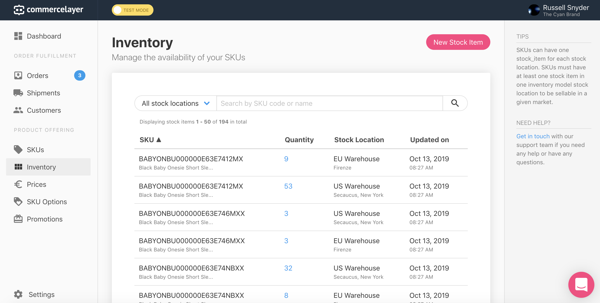
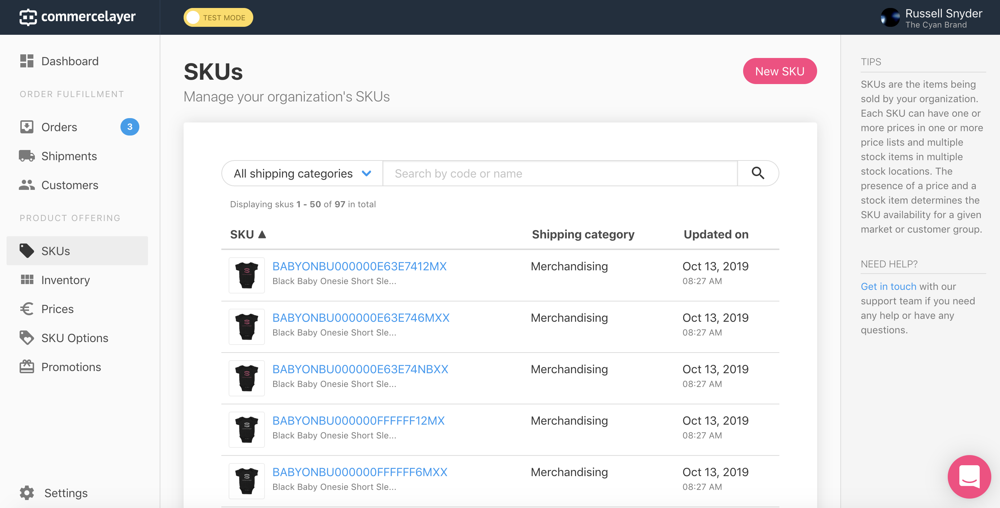
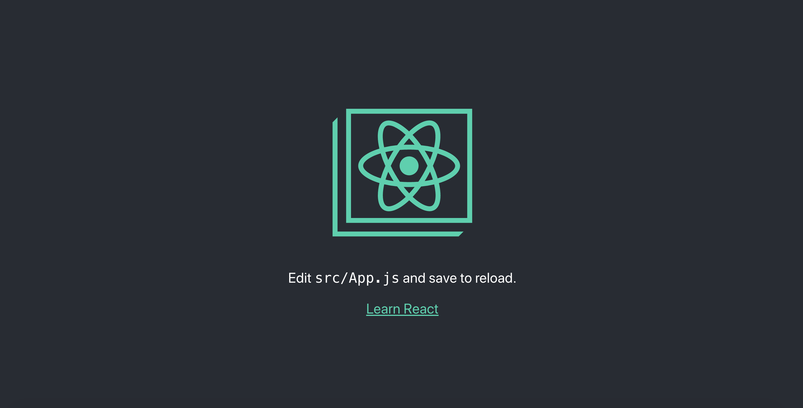
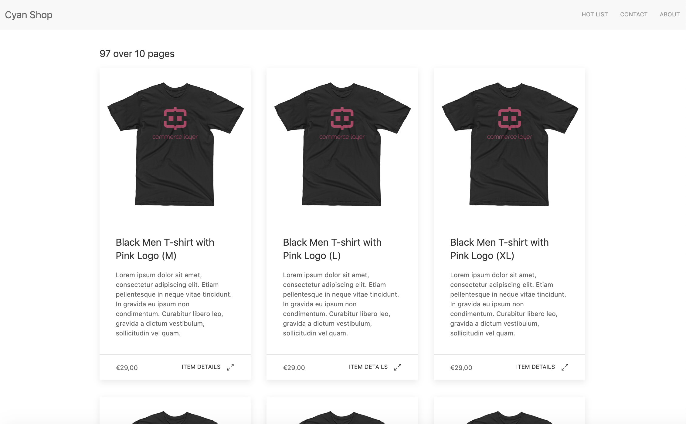

# Step 1 - Commerce Layer and React Prototype

## Commerce Layer

What is it?
Why?

## Create a Commerce Layer account

Create an account at https://commercelayer.io.
During the onboarding, it will ask you if you want to create test data.
Click yes!

This should create mock Inventory and SKUs for you as part of "the cyan brand".
It should look like this on the inventory page:


and this on the SKUs page:


The information on these pages will be the main data for out ecommerce shop.
Feel free to explore and add stuff, but we will come back to this later.

## Create a react app

If you don't have node installed yet, [download it here](https://nodejs.org/en/download/).
You will need node and it's package manager, npm, to complete the next steps.

We'll use [create-react-app](https://github.com/facebook/create-react-app) for the scaffolding of this app.

This CLI tool allows you to quickly have a react app with hot-reloading and creates folder structure for you that is typical of medium to larger websites.

Once you have it installed, run this command:

```
npx create-react-app cyan-brand-shop
```

If you follow along (and have a successful install) the CLI tells you 

```
We suggest that you begin by typing:

  cd cyan-brand-shop
  yarn start
```

Let's do just that. 

```
cd cyan-brand-shop
yarn start
```

A browser should open to http://localhost:3000/ with this image:


open the cyan-brand-shop in your favorite editor and let's get to hacking

## Get api keys from commerce layer

The JAM in JAM stack stands for "Javascript, APIs, and Markup".
Now our React app running, we are making progress with javascript and markup part.
Now comes the API part.

Credentials can be found in Settings > Applications > The Cyan Brand's Website 

In the Credential section you will see a Client ID and a Base Endpoint.
You'll need these for the next section

## CORS is annoying

But it's something we all have to face.
Create-react-app reads a file called setupProxy.js by default [just for this](https://create-react-app.dev/docs/proxying-api-requests-in-development#configuring-the-proxy-manually)
First install http-proxy-middleware with

```
yarn add http-proxy-middleware
```

then create ```setupProxy.js``` in the ```src/``` folder with the following code:

```
const proxy = require('http-proxy-middleware');

module.exports = function(app) {
    app.use('/api', proxy({
        target: 'http://[your-project-name].commercelayer.io',
        changeOrigin: true,
    }));
};
```

replacing 'your-project-name' with your project's name (the-cyan-brand-75 for example).
This should eliminate the CORS errors that result from working on a local server.

## Querying data with Axios

If you haven't seen it by now, The commerce layer documentation is really awesome.
You can read about it in [their documentation](https://commercelayer.io/api/reference/getting-started).
You should try out what they say using curl in the command line to get a feel for how the api works.
I set up a postman collection to try out different queries before I implement them in an app.


For javascript projects, I prefer to use axios as a fetch client because of it's easy to read and understand syntax.
Install axios with 

```
yarn add axios
```

To get the access token, I made this small function using axios:
```
const getAcessToken = () => {
    return axios({
        method: 'post',
        url: `https://the-cyan-brand-75.commercelayer.io/oauth/token`,
        headers: {
            "Accept": "application/json",
            "Content-Type": "application/json"
        },
        data: {
            "grant_type": "client_credentials",
            "client_id": "e3f24e4a6fb9a334306ec7da84d3d17331bd43506119794e7cdc9e9171957f7b",
            "scope": "market:1477"
        },
    })
}
```
replace the url, client id and scope to be whatever your commerce layer project is. 

Once you have the accessToken, to query the SKUs, I created this function:
```
const getSkuData = (accessToken) => {
    return axios({
        method: 'get',
        url: '/api/skus',
        headers: {
            "Authorization": `Bearer ${accessToken}`,
            "Content-Type": "application/vnd.api+json"
        },
        params: {
            include: "prices"
        }
    })
}
```

Both return promises, which is by design.
In general, if every api call returns a promise, it is easier to reason with what is happening, and you can chain the calls together.

That is exactly what I did when the App.js component is mounted:
```
    componentDidMount() {
        getAcessToken()
                .then(res => getSkuData(res.data.access_token))
                .then(res => {
                    const {data, meta, included} = res.data;
                    const priceData = included.filter(item => item.type === "prices")
                    this.setState({data, meta, included, priceData})
                })
                .catch(err => console.error(err))
    }
```

And that's it for it!
With just a few lines of code, we can grab all the SKUs from out commerce layer project directly from our app.

The astute web developer will see many, many flaws with the architecture at this point, and they would be right.
Exposed secret codes to the frontend, hard coded values, minimal error handling and not to mention that
everytime the component mounts, we are calling for an access token and querying all the data.
This will rack up a huge amount of calls very quickly which in turn will rack up $$$ for the app host when the app goes live.

BUT DONT WORRY!

We will explore in the next section how to use a pattern called "Backend for Frontend" to refactor much of this code.
This first section it a proof of concept that you can connect and query commerce layer from react (yay!)

## Making it look good with UI Kit

There are tons of CSS frameworks out there.
I chose UIKit for this project to get a more modern look and feel.
To install, run:
```
yarn add uikit
```

Then in your src/index.css, add the following to get uikit styles
```
@import "../node_modules/uikit/dist/css/uikit.min.css";
```

also import the javascript and icons into src/App.js by adding the following lines near the top of the page:
```
import UIkit from 'uikit';
import Icons from 'uikit/dist/js/uikit-icons';
// loads the Icon plugin
UIkit.use(Icons);
```

I think added the markup to src/App.js to render the data to look something like this:



Not bad for no css written :-)

## Preview of next section

Right now, none of the links work and the code to fetch the data is right next to code that renders the markup.
In the next section, we'll refactor the code to seperate these concerns as well as move data fetching to build time.
This will not only drastically increase speed or page loads, it will create a layer of security by hiding the api secrets from the client.
